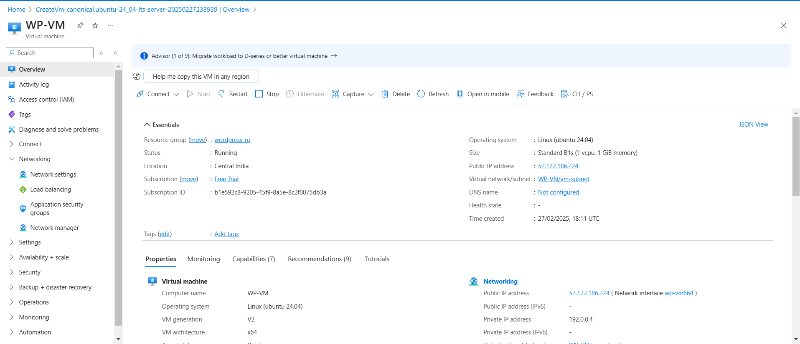
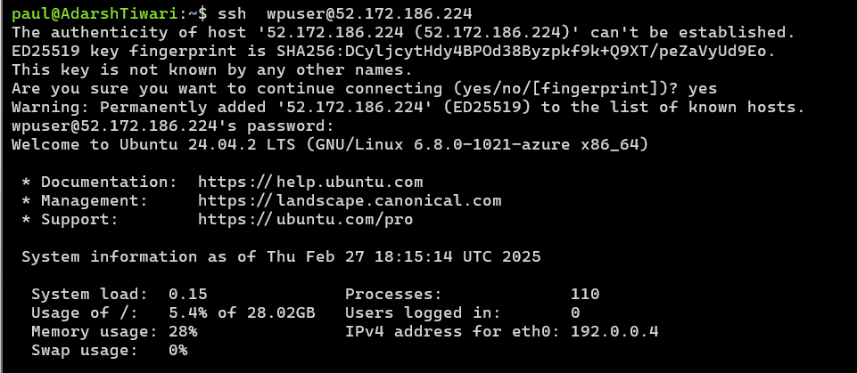

# LEMP Stack Project - Azure VM Deployment

## Project Overview
This project sets up a LEMP (Linux, Nginx, MySQL, PHP) stack on an Azure Virtual Machine (VM) to host a PHP-based application that interacts with a MySQL database. The project also includes security enhancements, SSL/TLS configuration, and performance optimizations.

## Prerequisites
- An active [Azure](https://portal.azure.com/) account
- A configured No-IP domain (`devtaskteam.zapto.com`)
- SSH access to the Azure VM
- Basic knowledge of Linux and MySQL

## Setup Instructions

### 1. Create an Azure Virtual Machine
1. Log in to [Azure Portal](https://portal.azure.com/).
2. Navigate to **Virtual Machines** and create a new VM with the following specs:
   - OS: Ubuntu 22.04 LTS
   - Size: Standard B1s (or higher based on expected traffic)
   - Authentication: SSH Public Key or Password
   
3. Allow inbound ports for HTTP (80), HTTPS (443), and SSH (22).

   


### 2. Login with SSH 

```bash
ssh  wpuser@52.172.186.224
```
 


### 2. Install LEMP Stack
Connect to the VM via SSH and run the following commands:

```bash
sudo apt update && sudo apt upgrade -y
sudo apt install -y nginx mysql-server php-fpm php-mysql
```

### 3. Configure MySQL Database
1. Secure the MySQL installation:
   ```bash
   sudo mysql_secure_installation
   ```
2. Log in to MySQL and create the database and table:
   ```sql
   CREATE DATABASE todo_db;
   USE todo_db;
   CREATE TABLE todo_list (
       id INT AUTO_INCREMENT PRIMARY KEY,
       task VARCHAR(255) NOT NULL,
       status ENUM('pending', 'completed') DEFAULT 'pending'
   );
   ```
3. Create a database user and grant privileges:
   ```sql
   CREATE USER 'todo_user'@'localhost' IDENTIFIED BY 'securepassword';
   GRANT ALL PRIVILEGES ON todo_db.* TO 'todo_user'@'localhost';
   FLUSH PRIVILEGES;
   ```

### 4. Deploy the PHP Application
Create a PHP file in the web root directory (`/var/www/html/index.php`) and add the following code:

```php
<?php
$servername = "localhost";
$username = "todo_user";
$password = "securepassword";
$dbname = "todo_db";

// Create connection
$conn = new mysqli($servername, $username, $password, $dbname);

// Check connection
if ($conn->connect_error) {
    die("Connection failed: " . $conn->connect_error);
}

$sql = "SELECT * FROM todo_list";
$result = $conn->query($sql);

echo "<h1>To-Do List</h1>";
if ($result->num_rows > 0) {
    while ($row = $result->fetch_assoc()) {
        echo "<p>{$row['task']} - Status: {$row['status']}</p>";
    }
} else {
    echo "<p>No tasks found.</p>";
}
$conn->close();
?>
```

### 5. Configure Nginx
1. Create a new Nginx server block configuration:
   ```bash
   sudo nano /etc/nginx/sites-available/default
   ```
2. Update the configuration:
   ```nginx
   server {
       listen 80;
       server_name devtaskteam.zapto.com;
       root /var/www/html;
       index index.php index.html index.htm;

       location / {
           try_files $uri $uri/ =404;
       }

       location ~ \.php$ {
           include snippets/fastcgi-php.conf;
           fastcgi_pass unix:/run/php/php-fpm.sock;
           fastcgi_param SCRIPT_FILENAME $document_root$fastcgi_script_name;
           include fastcgi_params;
       }
   }
   ```
3. Restart Nginx:
   ```bash
   sudo systemctl restart nginx
   ```

### 6. Secure the Server with SSL (Optional)
Use **Let's Encrypt** for free SSL:
```bash
sudo apt install certbot python3-certbot-nginx -y
sudo certbot --nginx -d devtaskteam.zapto.com
sudo systemctl restart nginx
```

### 7. Verify Deployment
- Open a browser and navigate to `http://devtaskteam.zapto.com`
- You should see the To-Do List displayed from the MySQL database.

## CI/CD with GitHub Actions
To automate deployment, you can set up GitHub Actions:
1. Push your PHP project to GitHub.
2. Create a `.github/workflows/deploy.yml` file.
3. Define deployment steps using SSH to sync files with the Azure VM.

## Security Best Practices
- Use **UFW** to allow only necessary ports:
  ```bash
  sudo ufw allow OpenSSH
  sudo ufw allow 'Nginx Full'
  sudo ufw enable
  ```
- Change MySQL root password and disable remote root login.
- Regularly update packages using:
  ```bash
  sudo apt update && sudo apt upgrade -y
  ```

## Future Enhancements
- Implement a frontend UI with Bootstrap
- Add user authentication for task management
- Set up a CI/CD pipeline with Azure DevOps

## Author
- **Your Name**
- Contact: `your-email@example.com`

