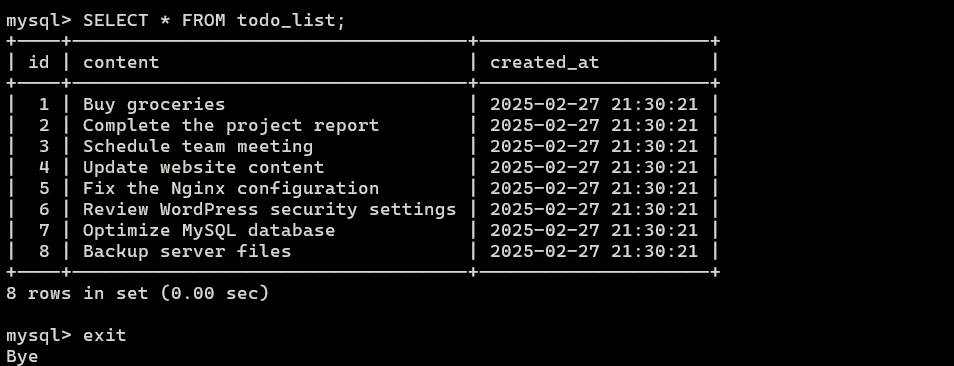

# LEMP Stack Project - Azure VM Deployment

## Project Overview
This project sets up a LEMP (Linux, Nginx, MySQL, PHP) stack on an Azure Virtual Machine (VM) to host a PHP-based application that interacts with a MySQL database. The project also includes security enhancements, SSL/TLS configuration, and performance optimizations.

## Prerequisites
- An active [Azure](https://portal.azure.com/) account
- A configured No-IP domain (`devtaskteam.zapto.com`)
- SSH access to the Azure VM
- Basic knowledge of Linux and MySQL

## Setup Instructions

### 1. Create an Azure Virtual Machine
1. Log in to [Azure Portal](https://portal.azure.com/).
2. Navigate to **Virtual Machines** and create a new VM with the following specs:
   - OS: Ubuntu 22.04 LTS
   - Size: Standard B1s (or higher based on expected traffic)
   - Authentication: SSH Public Key or Password
   
3. Allow inbound ports for HTTP (80), HTTPS (443), and SSH (22).

   


### 2. Login with SSH 

```bash
ssh  wpuser@52.172.186.224
```
 

### 3. Updating Packages on Azure Ubuntu VM using APT

```bash
 sudo apt update
```
 

### 4. Install Nginx on Ubuntu
```bash
sudo apt isntall nginx
```
When prompted, press Y and ENTER to confirm that you want to install Nginx. Once the installation is finished, the Nginx web server will be active and running on your Ubuntu server.
 

### 5. ufw file enabled
If you have the ufw firewall enabled, as recommended in our initial server setup guide, you will need to allow connections to Nginx. Nginx registers a few different UFW application profiles upon installation. To check which UFW profiles are available, run:
```bash
sudo ufw app list
```


Write the address that you receive in your web browser and it will take you to Nginx’s default landing page:
```bash
http://server_domain_or_IP
```


If you receive this page, you have successfully installed Nginx and enabled HTTP traffic for your web server.

### 6. Install MySQL

Now that you have a web server up and running, you need to install the database system to store and manage data for your site. MySQL is a popular database management system used within PHP environments.

```bash
sudo apt install mysql-server
```


When the installation is finished, it’s recommended that you run a security script that comes pre-installed with MySQL.

```bash
sudo mysql_secure_installation
```
If you answer “yes”, you’ll be asked to select a level of password validation.


When you’re finished, test if you’re able to log in to the MySQL console:
```bash
sudo mysql
```


### 7. Installing PHP
```bash
sudo apt install php8.1-fpm php-mysql
```
When prompted, press Y and ENTER to confirm the installation.
You now have your PHP components installed. Next, you’ll configure Nginx to use them.

### 8. Configuring Nginx to Use the PHP Processor
```bash
sudo mkdir /var/www/your_domain
```
Next, assign ownership of the directory with the $USER environment variable, which will reference your current system user:

```bash
sudo chown -R $USER:$USER /var/www/your_domain
```
Then, open a new configuration file in Nginx’s sites-available directory using your preferred command-line editor. Here, we’ll use nano:

```bash
sudo nano /etc/nginx/sites-available/your_domain
```
Add nginx server file given in below
```bash
server {
    listen 80;
    server_name devtaskteam.zapto.org;
    root /var/www/devtaskteam;
    index index.php index.html;

    location / {
        try_files $uri $uri/ =404;
    }

    location ~ \.php$ {
        include snippets/fastcgi-php.conf;
        fastcgi_pass unix:/run/php/php8.1-fpm.sock; # Adjust version if needed
        fastcgi_param SCRIPT_FILENAME $document_root$fastcgi_script_name;
        include fastcgi_params;
    }
}
```
Activate your configuration by linking to the configuration file from Nginx’s sites-enabled directory:
```bash
sudo ln -s /etc/nginx/sites-available/your_domain /etc/nginx/sites-enabled/
```
Then, unlink the default configuration file from the /sites-enabled/ directory:
```bash
sudo unlink /etc/nginx/sites-enabled/default

```
This will tell Nginx to use the configuration next time it is reloaded. You can test your configuration for syntax errors by running the following:
```bash
sudo nginx -t
```

When you are ready, reload Nginx to apply the changes:

```bash
sudo systemctl reload nginx
```

Your new website is now active, but the web root /var/www/your_domain is still empty. Create an index.html file in that location so that you can test that your new server block works as expected:

```bash
nano /var/www/your_domain/index.html
```
Include the following content in this file:

```bash
<html>
<head>
    <title>your_domain website</title>
</head>
<body>
    <h1>Hello World!</h1>
    <p>This is the landing page of <strong>your_domain</strong>.</p>
</body>
</html>
```
Now go to your browser and access your server’s domain name or IP address, as listed within the server_name directive in your server block configuration file:

```bash
http://server_domain_or_IP
```

You’ll receive a page like the following:


### 9. Testing PHP with Nginx

You can do this by creating a test PHP file in your document root. Open a new file called info.php within your document root in your preferred text editor:

```bash
nano /var/www/your_domain/info.php
```
Add the following lines into the new file. This is valid PHP code that will return information about your server:

```bash
<?php
phpinfo();
?>
```
You can now access this page in your web browser by visiting the domain name or public IP address you’ve set up in your Nginx configuration file, followed by /info.php:

```bash
http://server_domain_or_IP/info.php
```

You will receive a web page containing detailed information about your server:


After checking the relevant information about your PHP server through that page, it’s best to remove the file you created as it contains sensitive information about your PHP environment and your Ubuntu server. You can use rm to remove that file:
```bash
sudo rm /var/www/your_domain/info.php
```
### 10.  Testing Database Connection from PHP
First, connect to the MySQL console using the root account:
```bash
sudo mysql
```
Creates a new user named newuser, using mysql_native_password as the default authentication method. We’re defining this user’s password as Strong1234!, but you should replace this value with a secure password of your own choosing.
```bash
 CREATE USER 'newuser'@'localhost' IDENTIFIED BY 'Strong1234!';
```
Granting Full Privileges to a MySQL User with Grant Option

```bash
GRANT ALL PRIVILEGES ON *.* TO 'newuser'@'localhost' WITH GRANT OPTION;
```
Reloading MySQL Privileges with FLUSH PRIVILEGES

```bash
FLUSH PRIVILEGES;
```
Viewing MySQL Users and Their Host Permissions 
```bash
SELECT user, host FROM mysql.user;
```
exit from MySQL
```bash
exit
```
You can test if the new user has the proper permissions by logging in to the MySQL console again, using the custom user credentials. Notice the -p flag in this command, which will prompt you for the password used when creating the 'newuser' user, and here, the password is 'Strong1234!' :   

```bash
mysql -u newuser -p
```
To create a new database, run the following command from your MySQL console:

```bash
CREATE DATABASE todo_db;
```
Use the database that you created. Here I create todo_db:

```bash
USE todo_db;
```
Next, we’ll create a test table named todo_list. From the MySQL console, run the following statement:
```bash
CREATE TABLE todo_list (
	item_id INT AUTO_INCREMENT,
	content VARCHAR(255),
	PRIMARY KEY(item_id)
);

```
Run command SHOW TABLE in MySQL :
```bash
SHOW TABLES;
```
Insert data into table todo_list:
```bash
INSERT INTO todo_list (content) VALUES
('Buy groceries'),
('Complete the project report'),
('Schedule team meeting'),
('Update website content'),
('Fix the Nginx configuration'),
('Review WordPress security settings'),
('Optimize MySQL database'),
('Backup server files'); 
```
Retrieves and displays all columns and rows from the todo_list table.
 ```bash
SELECT * FROM todo_list;
```


And now exit from MySQL
```bash
exit
```
Create the File todo_list.php in /var/www/your_domain_directory/ sudo nano todo_list.php
```bash
sudo nano todo_list.php
```
Insert php file in todo_list.php with your user_name and password which you created in mysql 
```bash
<?php
error_reporting(E_ALL);
ini_set('display_errors', 1);

$user = "newuser";
$password = "Strong1234!";
$database = "todo_db";
$table = "todo_list";

try {
    $db = new PDO("mysql:host=localhost;dbname=$database;charset=utf8mb4", $user, $password, [
        PDO::ATTR_ERRMODE => PDO::ERRMODE_EXCEPTION,
        PDO::ATTR_DEFAULT_FETCH_MODE => PDO::FETCH_ASSOC,
        PDO::ATTR_EMULATE_PREPARES => false, 
    ]);

    $stmt = $db->prepare("SELECT content FROM $table");
    $stmt->execute();

    echo "<h2>TODO</h2><ol>";
    while ($row = $stmt->fetch()) {
        echo "<li>" . htmlspecialchars($row['content'], ENT_QUOTES, 'UTF-8') . "</li>";
    }
    echo "</ol>";

} catch (PDOException $e) {
    error_log("Database error: " . $e->getMessage()); // Log the error
    die("An error occurred. Please try again later."); // Display a user-friendly message
}
?>
```
Save and close the file when you’re done editing.


You can now access this page in your web browser by visiting the domain name or public IP address configured for your website, followed by /todo_list.php: 

 ```bash
http://server_domain_or_IP/todo_list.php
```


